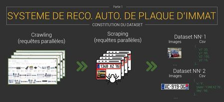

# PROJET DE WEB SCRAPING ET DEEP LEARNING
## DETECTION DE PLAQUE D'IMMATRICULATION

### SOMMAIRE
  - [Objectif du projet](#Objectif-du-projet)
  - [Méthodologie appliquée](#Méthodologie-appliquée)
  #### Full Deep Learning
  - [Modèle CNN](#Modèle-CNN)
  - [Modèle AutoEncodeur Apprentissage semi supervisé](#Modèle-AutoEncodeur-Apprentissage-semi-supervisé)
  - [Modèle GAN et DCGAN](#Modèle-GAN-et-DCGAN)
  - [Optimisation Modèle Full Deep Learning Renforcement Learning](#Optimisation-Modèle-Full-Deep-Learning-Renforcement-Learning)
  - [Supervising Tensorboard cas Modèle CNN](#Supervising-Tensorboard-cas-Modèle-CNN)
  - [Conclusion](#Conclusion)
  - [Difficultés](#Difficultés)

#### Objectif du projet

L'objectif de ce projet est d'executer quelques modèles de deep learning après avoir scraper des données.

Les données scraper contiennent des informations sur des images des voitures de plusieurs pays montrant leur plaque d'immatriculation et les images elles mêmes.

`data_csv`  : contient les données scraper dans un format csv

`data_images` : contient les images utilisées pour implementer les modèles

`plaquette` : contient le dossier où se trouve les scripts du scraping effectuer sur **scrapy**

`script` : contient les dossiers où se trouvent les Jupyter Notebook des différents modèles

Pour le projet Scrapy:

Ce spider permet de récuperer des photos de voitures avec des informations supplementaires:

Voici les données que l'on récupère :
| Type  | Nom |
| ------------- | ------------- |
| heure  | Heure de l'ajout de la voiture sur le site distant  |
| date | Date de l'ajout de la voiture sur le site distant  |
| voitureMarque | Marque de la voiture  |
| voitureModele | Modèle de la voiture  |
| imgGlobalName | Nom de l'image sauvegardé de la voiture globale  |
| imgPlaqueName | Nom de l'image sauvegardé de lla plaque d'immatriculation  |
| plateNumber | Numéro de la plaque  |

Pensez à régler dans les attributs de la classe du spider :
- Un fichier CSV contenant l'ensemble des attributs précédents
- Un dossier de destination pour les images des plaques
- Un dossier de destination pour les images des voitures
- Une fourchette d'interval à donner à notre spider concernant les pages à visiter

**Important :**
Imposez une version specifique à votre agent afin de le faire passer pour un vrai utilisateur et non un bot, permettant de bypass les erreurs 403 FORBIDDEN.

Lancement du spider
`$ scrapy runspider radar.py`

Pour executez les modèles:

Pensez à télécharger les notebooks et à signifier le chemin d'accès des dossiers des inputs

#### Méthodologie appliquée

# Modèle CNN:

Detection de la plaque d'immatriculation : l'objectif du modèle est de permettre à detecter correctement les plaques d'immatriculations des différentes pays à travers un modèle CNN.
Imaginez qu’une camera de surveillance n’arrive pas à détecter l’image d’une plaque d’immatriculation pour cause de la pluie, de la neige, …)

# Modèle AutoEncodeur (Apprentissage semi-supervisé)

Réduction de la dimensionnalité : l'objectif de ce modèle est de réduire la taille des entrées de nos images afin de la récréer à la sortie pour chaque phase.

C'est un cas simulaire au modèle ACP(Analyse en Composante Principale) pour l'apprentissage non-supervisé.
En effet, la capacité de traiter un grand nombre de fonctionnalités rend l'apprentissage en profondeur très puissant lorsqu'il s'agit de données non structurées.
Si les données sont trop simples ou incomplètes, il est très facile pour un modèle d'apprentissage en profondeur de devenir surajusté et de ne pas bien se généraliser à de nouvelles données.  

# Modèle DCGAN
Un DCGAN est une extension directe du GAN sauf qu'il utilise explicitement des couches de convolution et de transposition de convolution dans le discriminateur et le générateur.
Dans ce modèle, nous formerons un réseaux accusatoires génératifs à convolution profonde pour générer de nouvelles images de plaques d'immatriculations après lui avoir montré des photos de nombreuses vraies images de plaques d'immatriculations.

# Optimisation Modèle Full Deep Learning Renforcement Learning

Dans cette partie nous allons nous inspiré de notre modèle de Q-learning pour l'automatisation d'un robot pour une entreprise logistique e-commerce un projet que nous devons présenter en decembre 2021 pour le cours de Renforcement Learning. 
De ce fait, c'est plutôt un modèle simulaire à quelques différences près.
Notre modèle Modeling-learnng c'est un modèle qui n'existe pas dans la réalité les techniques et les méthodes sont propres à nous.

Qu’est-ce qui se passe ? Si N = nombres d’images augmentent. Avec N0 = Nombre d'images initialement = 5000 images.
NB: Le but est de trouver le model qui arrive à prédire correctement plus d’images que les autres. 

Nous allons aussi faire une différence absolue et rélative entre les modèles afin d'identifier le modèle qui prédire plus d'images que les autres en comparant la distribution aléatoire et `l'algorithme de THOMPSON SAMPLY` .

#### Supervising Tensorboard cas Modèle CNN

Dans cette partie nous allons utiliser la fonction callbalck pour répresenter les graphiques de model loss et d'accuracy.
La partie visualisation graphique ne sera pas introduit pour faute de temps mais on mettra le lien Tensorboard si possible.
DEMONSTRATION pendant le cours. 

## Conclusion

## Difficultés 

### Pour la PARTIE SCRAPY:

Scraper plusieurs pages : on avait un problème lorsque on utilisait la fonction urlibjoin pour passer de page à page. En effet, lorsqu'on l'exécutait on avait bien les résultats mais le site s'etendait à plus de 100 PAGES.
De ce fait, lorsqu'on mettait une limite de 100 pages , le script continuait et donc nous avions corriger cela avec la fonction callbalck. 

### Pour la partie Deep Learning :

* Problème rencontrer : lorsuq'on a voulu transformer notre variable prédict y en catégorie :

il fallait d'abord labeliser la variable y en convertisant la matrice name belgique en 1 et ainsi que pour les autres pays. Ensuite il fallait fit(FITER) les variables qui étaient en l'interieur de sorte que nous puissions les transformer en matrice résolution stack overflow.
 `ValueError: invalid literal for int() with base 10: <s>.`

* Optimisation Modèle Full Deep Learning Renforcement Learning : Nous rappellons tout de même que la selection du meilleur modèle n'est possible que si les paramètres permettant d'obtenir le taux de conversion pour l'accuracy reste le même ceteris paribus(epoch,verbose, optimiser,...)
  

